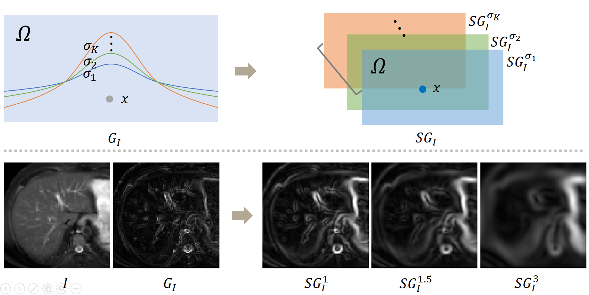

# MMRegnet
The project is still under constructing.

# Abstract 
Multi-modality medical images can provide relevant or complementary information for a target (organ, tumor or tissue). Registering multi-modality images to a common space can fuse these comprehensive information, and bring convenience for clinical application.Recently, neural networks have been widely investigated to boost registration methods. However, it is still challenging to develop a multi-modality registration network due to the lack of robust criteria for network training. In this work, we propose a multi-modality registration network (MMRegNet), which can perform registration between multi-modality images. Meanwhile, we present spatially encoded gradient information to train MMRegNet in an unsupervised manner.The proposed network was evaluated on the public dataset from MM-WHS 2017. Results show that MMRegNet can achieve promising performance for left ventricle registration tasks. Meanwhile, to demonstrate the versatility of MMRegNet, we further evaluate the method using a liver dataset from CHAOS 2019.# Cross-Modality Multi-Atlas Segmentation UsingDeep Neural Networks This repository contains the code for the paper "Cross-Modality Multi-Atlas Segmentation UsingDeep Neural Networks", which proposes multi-atlas segmentation framework based on deep neural network from cross-modality medical images. The project is still under constructing. At present, we have released the core codes.   

This registration network has been applied to liver and heart segmentation task:
[CHAOS](https://chaos.grand-challenge.org/) & [MMWHS](http://www.sdspeople.fudan.edu.cn/zhuangxiahai/0/mmwhs17/index.html).

A visual demonstration of the SEGI. :
<!--  --> 

Visualization of different methods on MM-WHS and CHAOS datasets. The showed images are the representative cases in terms of DS by MMRegNet. The blue contours are the gold standard label of the fixed images, while the red contours delineate the label of moving or moved images. We indicate the advantage of MMRegNet via yellow arrows.:
<!--  -->

## Project Overview
- [multi modality registration network](./proj/joint_unsupervised_mm_reg_img.py): Train&Test script for MMReg.

## Acknowledgement
This project is largely based on the "labreg", "simpleitk", "antspy" and "voxelmorph" repositories.

## Contact
If you have any question or issuse, create a new issue, or directly email me at moon_well@live.cn
